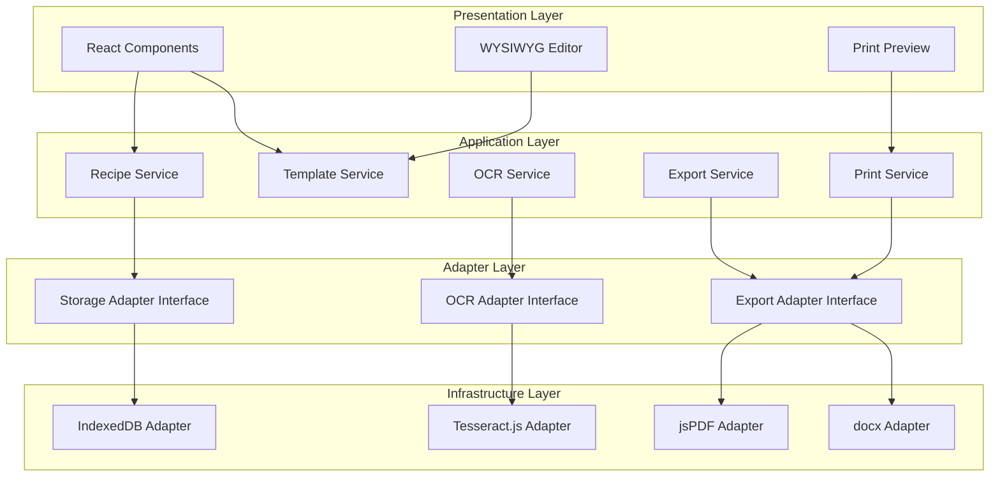

# Design Document: Recipe Archive

## Overview

Recipe Archive is a client-side web application built with TypeScript and React that enables users to digitize, organize, and print family recipes. The architecture follows a layered design with abstract interfaces for storage, OCR, and export operations, enabling future migration to cloud-native backends without modifying application logic.

Key technology choices:
- **Frontend**: React with TypeScript for type safety and component reusability
- **OCR**: Tesseract.js for client-side optical character recognition
- **PDF Export**: jsPDF for client-side PDF generation
- **Word Export**: docx library for DOCX generation (more widely supported than RTF)
- **Storage**: IndexedDB via an adapter interface (localStorage backup for small data)
- **State Management**: React Context + useReducer for predictable state updates
- **Styling**: CSS Modules or Tailwind CSS for component-scoped styling

## Architecture



## Components and Interfaces

### Storage Adapter Interface

```typescript
interface StorageAdapter {
  // Recipe operations
  createRecipe(recipe: Recipe): Promise<Recipe>;
  getRecipe(id: string): Promise<Recipe | null>;
  updateRecipe(id: string, recipe: Partial<Recipe>): Promise<Recipe>;
  deleteRecipe(id: string): Promise<void>;
  listRecipes(filter?: RecipeFilter): Promise<Recipe[]>;
  
  // Template operations
  createTemplate(template: Template): Promise<Template>;
  getTemplate(id: string): Promise<Template | null>;
  updateTemplate(id: string, template: Partial<Template>): Promise<Template>;
  deleteTemplate(id: string): Promise<void>;
  listTemplates(): Promise<Template[]>;
  
  // Bulk operations
  exportAll(): Promise<ExportData>;
  importAll(data: ExportData): Promise<ImportResult>;
}
```

### OCR Adapter Interface

```typescript
interface OCRAdapter {
  initialize(): Promise<void>;
  recognizeText(image: ImageSource): Promise<OCRResult>;
  terminate(): Promise<void>;
}

interface OCRResult {
  text: string;
  confidence: number;
  inferredAuthor: string | null;
  blocks: TextBlock[];
}

interface TextBlock {
  text: string;
  boundingBox: BoundingBox;
  confidence: number;
}
```

### Export Adapter Interface

```typescript
interface ExportAdapter {
  exportToPDF(recipe: Recipe, template: Template): Promise<Blob>;
  exportToDOCX(recipe: Recipe, template: Template): Promise<Blob>;
  generatePrintDocument(recipe: Recipe, template: Template, options: PrintOptions): Promise<Blob>;
}

interface PrintOptions {
  size: PrintSize;
  duplexMode: 'simplex' | 'duplex-long' | 'duplex-short';
  copies: number;
}
```

### React Components

```typescript
// Main application shell
interface AppShellProps {
  children: React.ReactNode;
}

// Recipe list with filtering
interface RecipeListProps {
  recipes: Recipe[];
  onSelect: (recipe: Recipe) => void;
  onDelete: (id: string) => void;
  filter: RecipeFilter;
  onFilterChange: (filter: RecipeFilter) => void;
}

// Recipe editor form
interface RecipeEditorProps {
  recipe?: Recipe;
  onSave: (recipe: Recipe) => void;
  onCancel: () => void;
}

// Image upload with OCR
interface ImageUploaderProps {
  onTextExtracted: (result: OCRResult) => void;
  onError: (error: Error) => void;
}

// Manual recipe creation (alternative to OCR)
interface ManualRecipeCreatorProps {
  onSave: (recipe: Recipe) => void;
  onCancel: () => void;
}

// Recipe creation mode selector
interface RecipeCreationModeProps {
  onSelectOCR: () => void;
  onSelectManual: () => void;
}

// WYSIWYG template editor
interface TemplateEditorProps {
  template: Template;
  recipe?: Recipe;
  onChange: (template: Template) => void;
}

// Print preview modal
interface PrintPreviewProps {
  recipe: Recipe;
  template: Template;
  onPrint: (options: PrintOptions) => void;
  onExport: (format: 'pdf' | 'docx') => void;
  onClose: () => void;
}
```

## Data Models

### Recipe

```typescript
interface Recipe {
  id: string;
  title: string;
  author: string | null;
  ingredients: string[];
  steps: string[];
  notes: string | null;
  images: RecipeImage[];
  tags: string[];
  sourceImage: string | null; // Original scanned image
  createdAt: string; // ISO 8601
  updatedAt: string; // ISO 8601
}

interface RecipeImage {
  id: string;
  data: string; // Base64 encoded
  caption: string | null;
  position: 'inline' | 'header' | 'footer';
}

interface RecipeFilter {
  tags?: string[];
  tagMatchMode: 'and' | 'or'; // 'and' by default
  author?: string;
  searchText?: string;
  sortBy: 'title' | 'createdAt' | 'updatedAt' | 'author';
  sortOrder: 'asc' | 'desc';
}
```

### Template

```typescript
interface Template {
  id: string;
  name: string;
  size: PrintSize;
  isDefault: boolean;
  sections: TemplateSection[];
  margins: Margins;
  createdAt: string;
  updatedAt: string;
}

interface PrintSize {
  name: string;
  width: number;  // in millimeters
  height: number; // in millimeters
  type: 'card' | 'paper';
}

// Predefined sizes
const PRINT_SIZES: Record<string, PrintSize> = {
  'card-3x5': { name: '3x5 Card', width: 76.2, height: 127, type: 'card' },
  'card-4x6': { name: '4x6 Card', width: 101.6, height: 152.4, type: 'card' },
  'card-5x7': { name: '5x7 Card', width: 127, height: 177.8, type: 'card' },
  'letter': { name: 'Letter', width: 215.9, height: 279.4, type: 'paper' },
  'legal': { name: 'Legal', width: 215.9, height: 355.6, type: 'paper' },
  'a4': { name: 'A4', width: 210, height: 297, type: 'paper' },
  'a5': { name: 'A5', width: 148, height: 210, type: 'paper' },
};

interface TemplateSection {
  id: string;
  type: 'title' | 'author' | 'ingredients' | 'steps' | 'notes' | 'image';
  position: Position;
  size: Size;
  style: SectionStyle;
  zIndex: number; // For layering overlapping sections
}

interface Position {
  x: number; // percentage of card width
  y: number; // percentage of card height
}

interface Size {
  width: number;  // percentage of card width
  height: number; // percentage of card height
}

// Overlap detection for visual feedback in editor
interface SectionOverlap {
  section1Id: string;
  section2Id: string;
  overlapArea: number; // percentage of smaller section that overlaps
}

interface SectionStyle {
  fontSize: number;
  fontFamily: string;
  fontWeight: 'normal' | 'bold';
  textAlign: 'left' | 'center' | 'right';
  color: string;
  backgroundColor: string | null;
  padding: number;
  border: BorderStyle | null;
}

interface Margins {
  top: number;
  right: number;
  bottom: number;
  left: number;
}
```

### Export Data Format

```typescript
interface ExportData {
  version: string;
  exportedAt: string;
  recipes: Recipe[];
  templates: Template[];
  tags: string[];
}

interface ImportResult {
  success: boolean;
  recipesImported: number;
  templatesImported: number;
  errors: ImportError[];
}

interface ImportError {
  type: 'recipe' | 'template';
  id: string;
  message: string;
}
```


## Correctness Properties

*A property is a characteristic or behavior that should hold true across all valid executions of a system—essentially, a formal statement about what the system should do. Properties serve as the bridge between human-readable specifications and machine-verifiable correctness guarantees.*

### Property 1: Recipe Persistence Round-Trip

*For any* valid Recipe object, saving it to the Storage_Adapter and then retrieving it by ID should produce an equivalent Recipe object (with matching id, title, author, ingredients, steps, tags, and images).

**Validates: Requirements 2.2, 7.1**

### Property 2: Recipe Deletion Removes Recipe

*For any* Recipe that exists in storage, after deletion, attempting to retrieve that Recipe by ID should return null, and the Recipe should not appear in listRecipes results.

**Validates: Requirements 2.3**

### Property 3: Recipe Modification Updates Timestamp

*For any* Recipe modification (changing title, author, ingredients, steps, tags, or images), the updatedAt timestamp after the modification should be greater than or equal to the updatedAt timestamp before the modification.

**Validates: Requirements 2.5**

### Property 4: Tag Addition Associates Tag

*For any* Recipe and any valid tag string, after adding the tag to the Recipe, the Recipe's tags array should contain that tag.

**Validates: Requirements 3.1**

### Property 5: Tag Removal Disassociates Tag

*For any* Recipe with one or more tags, after removing a specific tag from the Recipe, the Recipe's tags array should not contain that tag.

**Validates: Requirements 3.2**

### Property 6: Filtering Returns Only Matching Recipes

*For any* set of Recipes and any RecipeFilter:
- When tagMatchMode is 'and': all Recipes returned should contain ALL specified filter tags
- When tagMatchMode is 'or': all Recipes returned should contain AT LEAST ONE of the specified filter tags
- When author is specified: all Recipes returned should match the specified author

**Validates: Requirements 3.3, 3.4**

### Property 7: Sorting Orders Recipes Correctly

*For any* set of Recipes and any sort criteria (title, createdAt, updatedAt, author) with sort order (asc/desc), the Recipes returned by listRecipes should be ordered such that for any two adjacent Recipes in the result, the first Recipe's sort field value should be less than or equal to (for asc) or greater than or equal to (for desc) the second Recipe's sort field value.

**Validates: Requirements 3.5**

### Property 8: Template Persistence Round-Trip

*For any* valid Template object, saving it to the Storage_Adapter and then retrieving it by ID should produce an equivalent Template object (with matching id, name, size, sections, and margins).

**Validates: Requirements 4.2**

### Property 9: Default Templates Cannot Be Deleted

*For any* Template where isDefault is true, attempting to delete that Template should fail (throw an error or return false), and the Template should remain retrievable.

**Validates: Requirements 4.5**

### Property 10: Template Sections Respect Boundary Constraints

*For any* TemplateSection within a Template, the section's position (x, y) should be in the range [0, 100], and the section's size (width, height) should be in the range [0, 100]. Sections may overlap each other (no constraint on position + size ≤ 100 relative to other sections), but each section must remain within the card boundaries (x + width ≤ 100, y + height ≤ 100 for that individual section).

**Validates: Requirements 5.2, 5.3, 5.5**

### Property 16: Overlap Detection Identifies All Overlapping Sections

*For any* Template with multiple sections, the overlap detection function should correctly identify all pairs of sections that overlap, and the reported overlap area should be accurate (within tolerance).

**Validates: Requirements 5.2, 5.3**

### Property 11: Print Document Matches Selected Size

*For any* Recipe and Template combination, the generated print document dimensions should match the Template's PrintSize dimensions (within a small tolerance for PDF generation precision).

**Validates: Requirements 6.1**

### Property 12: Print Document Contains All Template Sections

*For any* Recipe and Template combination, the generated print document should contain content for each TemplateSection defined in the Template (title section contains recipe title, ingredients section contains recipe ingredients, etc.).

**Validates: Requirements 6.3**

### Property 13: Overflow Detection Identifies Boundary Violations

*For any* Recipe content and Template combination where the rendered content would exceed the Template's boundaries, the overflow detection function should return true and identify which sections overflow.

**Validates: Requirements 6.5**

### Property 14: Export/Import Round-Trip Preserves Data

*For any* collection of Recipes and Templates, exporting to JSON and then importing from that JSON should result in an equivalent collection (same number of recipes and templates, with matching content).

**Validates: Requirements 7.4, 7.5**

### Property 15: All Saved Recipes Are Retrievable

*For any* set of Recipes saved to storage, calling listRecipes() with no filter should return all saved Recipes (the count should match the number saved, and each saved Recipe should be present in the results).

**Validates: Requirements 7.2**

## Error Handling

### OCR Errors

| Error Condition | Handling Strategy |
|----------------|-------------------|
| Image format not supported | Display error message, list supported formats |
| OCR initialization failure | Retry with exponential backoff, fallback to manual entry |
| OCR processing timeout | Cancel operation, offer retry or manual entry |
| No text detected | Notify user, enable manual text entry mode |
| Low confidence result | Display result with warning, highlight low-confidence sections |

### Storage Errors

| Error Condition | Handling Strategy |
|----------------|-------------------|
| IndexedDB not available | Fall back to localStorage with size warning |
| Storage quota exceeded | Prompt user to delete old recipes or export data |
| Corrupted data on load | Attempt recovery, offer to restore from backup |
| Concurrent modification | Last-write-wins with conflict notification |

### Export Errors

| Error Condition | Handling Strategy |
|----------------|-------------------|
| PDF generation failure | Display error, offer alternative format |
| DOCX generation failure | Display error, offer PDF alternative |
| Content overflow | Warn user, offer to auto-scale or truncate |
| Invalid template | Revert to default template with notification |

### Import Errors

| Error Condition | Handling Strategy |
|----------------|-------------------|
| Invalid JSON format | Display parse error location, reject import |
| Schema validation failure | List invalid fields, offer partial import |
| Duplicate IDs | Offer to skip, overwrite, or rename |
| Missing required fields | List missing fields, reject affected items |

## Testing Strategy

### Unit Tests

Unit tests verify specific examples and edge cases:

- **Storage Adapter**: CRUD operations, error conditions, edge cases (empty strings, special characters)
- **OCR Adapter**: Mock Tesseract.js responses, author inference patterns
- **Export Adapter**: PDF/DOCX generation with various content types
- **Filter/Sort Logic**: Specific filter combinations, sort edge cases
- **Template Validation**: Boundary constraint enforcement, section overlap detection

### Property-Based Tests

Property-based tests verify universal properties across randomly generated inputs. Each property test should run a minimum of 100 iterations.

**Testing Framework**: fast-check (TypeScript property-based testing library)

**Generators Required**:
- `arbitraryRecipe()`: Generates valid Recipe objects with random content
- `arbitraryTemplate()`: Generates valid Template objects with random sections
- `arbitraryRecipeFilter()`: Generates valid filter combinations
- `arbitraryPrintSize()`: Generates valid print size configurations

**Property Test Annotations**:
Each property test must be annotated with:
```typescript
// Feature: recipe-archive, Property N: [property description]
// Validates: Requirements X.Y, X.Z
```

### Integration Tests

- End-to-end recipe creation flow (upload → OCR → edit → save)
- Template creation and application to recipes
- Export/import cycle with real file operations
- Print preview generation with various templates

### Test Coverage Goals

- Unit tests: 80% line coverage for business logic
- Property tests: All 15 correctness properties implemented
- Integration tests: Critical user flows covered
