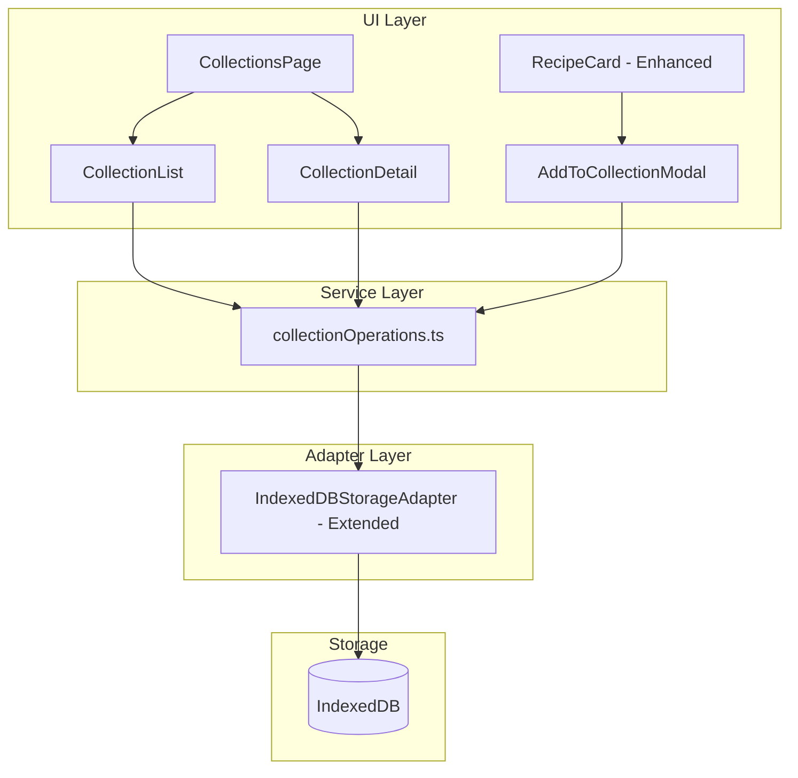

# Design Document: Recipe Collections

## Overview

This design describes the implementation of a recipe collections feature for the Recipe Archive application. Collections allow users to group recipes into named sets for organization, browsing, and batch export. The feature integrates with the existing architecture by adding a new data type, storage operations, UI components, and a dedicated Collections page accessible via a new navigation tab.

## Architecture

The collections feature follows the existing hexagonal architecture pattern used by the Recipe Archive:



The design extends the existing storage adapter interface to support collection CRUD operations while maintaining backward compatibility with existing recipe and template operations.

## Components and Interfaces

### New Components

1. **CollectionsPage** (`src/components/pages/CollectionsPage.tsx`)
   - Main page component for collection management
   - Handles view mode switching between list and detail views
   - Manages collection state and CRUD operations

2. **CollectionList** (`src/components/CollectionList.tsx`)
   - Displays all collections in a card grid layout
   - Shows collection name, description, and recipe count
   - Provides create, edit, and delete actions

3. **CollectionDetail** (`src/components/CollectionDetail.tsx`)
   - Shows full collection details with recipe list
   - Allows removing recipes from collection
   - Provides export functionality (PDF, JSON)

4. **AddToCollectionModal** (`src/components/AddToCollectionModal.tsx`)
   - Modal/dropdown for adding a recipe to collections
   - Shows all available collections with checkmarks for existing membership
   - Allows quick collection creation

### Modified Components

1. **AppShell** - Add "Collections" navigation tab
2. **RecipeCard** - Add collection button and collection indicators
3. **RecipeList** - Pass collections data to RecipeCard components

### Service Functions

**collectionOperations.ts**:
```typescript
// Create a new collection
function createCollection(name: string, description?: string): Collection

// Validate collection name (non-empty, non-whitespace)
function validateCollectionName(name: string): { valid: boolean; error?: string }

// Add recipe to collection (prevents duplicates)
function addRecipeToCollection(collection: Collection, recipeId: string): Collection

// Remove recipe from collection
function removeRecipeFromCollection(collection: Collection, recipeId: string): Collection

// Get collections containing a specific recipe
function getCollectionsForRecipe(collections: Collection[], recipeId: string): Collection[]

// Export collection recipes to JSON
function exportCollectionToJSON(collection: Collection, recipes: Recipe[]): ExportData

// Sort collections alphabetically
function sortCollections(collections: Collection[]): Collection[]
```

## Data Models

### Collection Type

```typescript
interface Collection {
  id: string;           // Unique identifier (UUID)
  name: string;         // Collection name (required, non-empty)
  description: string | null;  // Optional description
  recipeIds: string[];  // Array of recipe IDs in this collection
  createdAt: string;    // ISO 8601 timestamp
  updatedAt: string;    // ISO 8601 timestamp
}
```

### Extended Storage Adapter Interface

```typescript
interface StorageAdapter {
  // Existing recipe and template operations...
  
  // Collection operations
  createCollection(collection: Collection): Promise<Collection>;
  getCollection(id: string): Promise<Collection | null>;
  updateCollection(id: string, collection: Partial<Collection>): Promise<Collection>;
  deleteCollection(id: string): Promise<void>;
  listCollections(): Promise<Collection[]>;
}
```

### Extended Export Data

```typescript
interface ExportData {
  version: string;
  exportedAt: string;
  recipes: Recipe[];
  templates: Template[];
  tags: string[];
  collections?: Collection[];  // New field for collections
}
```

## Correctness Properties

*A property is a characteristic or behavior that should hold true across all valid executions of a system-essentially, a formal statement about what the system should do. Properties serve as the bridge between human-readable specifications and machine-verifiable correctness guarantees.*


### Property 1: Collection Creation Structure

*For any* valid (non-empty, non-whitespace) collection name, creating a collection SHALL produce an object with a unique ID, the provided name, an empty recipeIds array, and valid ISO 8601 timestamps for createdAt and updatedAt.

**Validates: Requirements 1.2**

### Property 2: Whitespace Name Rejection

*For any* string composed entirely of whitespace characters (including empty string), the validation function SHALL return invalid with an error message.

**Validates: Requirements 1.3, 1.4, 3.5**

### Property 3: Collection Persistence Round-Trip

*For any* valid collection, creating it in storage and then retrieving it by ID SHALL return an equivalent collection object.

**Validates: Requirements 1.5**

### Property 4: Alphabetical Sorting

*For any* list of collections, after sorting, each collection's name SHALL be lexicographically less than or equal to the next collection's name.

**Validates: Requirements 2.4**

### Property 5: Update Preserves Changes

*For any* collection and valid update (name or description), updating the collection SHALL result in the new values being present and the updatedAt timestamp being greater than or equal to the original.

**Validates: Requirements 3.1, 3.2**

### Property 6: Add Recipe Inclusion

*For any* collection and recipe ID not already in the collection, adding the recipe SHALL result in the recipe ID being present in the recipeIds array.

**Validates: Requirements 3.3, 8.3**

### Property 7: Remove Recipe Exclusion

*For any* collection containing a recipe ID, removing that recipe SHALL result in the recipe ID not being present in the recipeIds array.

**Validates: Requirements 3.4**

### Property 8: Add Recipe Idempotence

*For any* collection and recipe ID already in the collection, adding the recipe again SHALL not change the length of the recipeIds array (no duplicates).

**Validates: Requirements 3.6, 8.4**

### Property 9: Delete Removes Collection

*For any* collection that exists in storage, deleting it and then attempting to retrieve it SHALL return null.

**Validates: Requirements 4.2**

### Property 10: Delete Preserves Recipes

*For any* collection containing recipe IDs, deleting the collection SHALL not affect the existence of those recipes in storage.

**Validates: Requirements 4.3**

### Property 11: JSON Export Contains Recipes

*For any* collection with recipes, exporting to JSON SHALL produce an ExportData object where the recipes array contains exactly the recipes referenced by the collection's recipeIds.

**Validates: Requirements 5.3**

### Property 12: Backup Round-Trip

*For any* set of collections, exporting all data and then importing it SHALL preserve all collections with equivalent data.

**Validates: Requirements 7.3, 7.4**

### Property 13: Get Collections For Recipe

*For any* recipe ID and list of collections, the getCollectionsForRecipe function SHALL return exactly those collections whose recipeIds array contains that recipe ID.

**Validates: Requirements 8.6**

## Error Handling

### Validation Errors

| Error Condition | Handling |
|----------------|----------|
| Empty collection name | Return validation error, prevent creation/update |
| Whitespace-only name | Return validation error, prevent creation/update |
| Collection not found | Return null for get, throw error for update/delete |
| Duplicate recipe add | Silently ignore (idempotent operation) |

### Storage Errors

| Error Condition | Handling |
|----------------|----------|
| IndexedDB unavailable | Display error message, disable collection features |
| Storage quota exceeded | Display error message with suggestion to export/delete |
| Concurrent modification | Last write wins (standard IndexedDB behavior) |

### Export Errors

| Error Condition | Handling |
|----------------|----------|
| Empty collection export | Display informational message, no file generated |
| Recipe not found during export | Skip missing recipe, include warning in result |
| PDF generation failure | Display error, suggest JSON export as alternative |

## Testing Strategy

### Property-Based Testing

Property-based tests will use **fast-check** library (already available in the project) to verify correctness properties across many generated inputs.

Configuration:
- Minimum 100 iterations per property test
- Each test tagged with: **Feature: recipe-collections, Property {number}: {property_text}**

### Unit Tests

Unit tests will cover:
- Specific examples demonstrating correct behavior
- Edge cases (empty strings, special characters in names)
- Error conditions and validation failures
- Integration between components

### Test File Structure

```
src/test/
├── collectionOperations.test.ts    # Service function tests
├── collectionStorage.test.ts       # Storage adapter tests
└── generators.ts                   # Extended with collection generators
```

### Generator Strategy

```typescript
// Collection name generator - valid names
const validCollectionName = fc.string({ minLength: 1 })
  .filter(s => s.trim().length > 0);

// Collection generator
const collection = fc.record({
  id: fc.uuid(),
  name: validCollectionName,
  description: fc.option(fc.string(), { nil: null }),
  recipeIds: fc.array(fc.uuid()),
  createdAt: fc.date().map(d => d.toISOString()),
  updatedAt: fc.date().map(d => d.toISOString()),
});

// Whitespace-only string generator for validation tests
const whitespaceOnly = fc.stringOf(fc.constantFrom(' ', '\t', '\n', '\r'));
```
